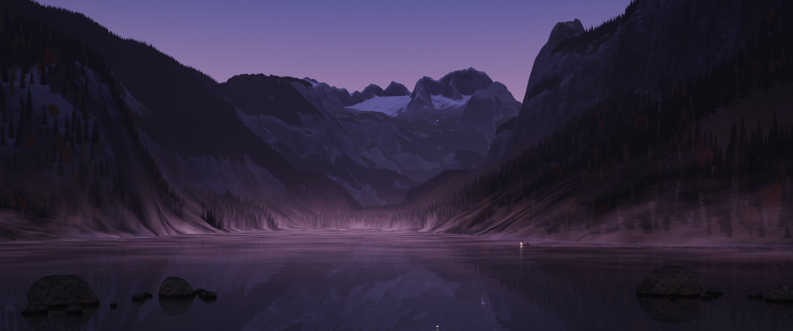

# Moje tapeta: živé Rakouské Alpy na ploše Windows



**[▶ Video (27 s)](postup/video/moje-tapeta-linkedin.mp4)** · **[Co všechno tapeta umí](postup/video/PREZENTACE.md)** · **[Galerie vývoje](postup/README.md)**

Horské jezero Gosausee s Dachsteinem ze skutečných výškových dat Rakouska. Slunce podle hodin, roční období podle kalendáře, počasí podle aktuálních dat z Gosau a skutečná noční obloha. Každý snímek se počítá v reálném čase na grafické kartě; když hrajete hru, tapeta se sama zastaví.

**Rychlý start:** potřebujete Windows 10 nebo 11 s Microsoft Edge WebView2 (ve Windows 11 je). Stáhněte repozitář a spusťte `host\install.cmd`. Aplikace se sestaví vestavěným kompilátorem .NET Framework 4.8, nainstaluje bez práv správce a spustí se po každém přihlášení. Odinstalace: `host\uninstall.cmd`.

*Made with Claude – model Opus 5.5.* Celou tapetu, od aplikace pro Windows po shadery, napsal Claude v Claude Code podle zadání a připomínek autora (Jiří Macek).

---

Živá tapeta pro Windows 10 a 11. Na každý monitor položí pod ikony plochy okno s WebView2 a posílá do něj polohu kurzoru. Ikony, klikání i výběr na ploše fungují dál jako obvykle.

Obsahuje scénu **Rakouské Alpy**: horské jezero Gosausee pod vápencovým masivem Dachsteinu s ledovcem, se skutečným časem, ročním obdobím a počasím.

### Rakouské Alpy

- **Skutečná krajina**: výhled z hladiny Vorderer Gosausee na Hoher Dachstein a Gosauský ledovec, spočítaný z digitálního modelu terénu Rakouska. Data jsou po 25 m, skalní pilíře, lavice vápence a škrapy do nich dokresluje šum. Počítá se raymarchingem se 4 paprsky na pixel: nejdřív se ukáže rychlý náhled a plné rozlišení se dopočítá do několika sekund, rozložené do snímků.
- **Den a noc podle skutečného času**: slunce se pohybuje podle hodin počítače a podle astronomických vzorců pro Gosau. Tapeta tak ukáže ráno, poledne, zlatou hodinku, soumrak i noc. Světlo se počítá každý snímek, do textur se ukládá jen materiál krajiny.
  - **Zlatá hodinka**: štíty chytají oranžové světlo, sníh růžoví a údolí zůstávají v modrých stínech. Nad obzorem je šedomodrý stín Země a nad ním růžový Venušin pás.
  - **Noc**: skutečná noční obloha nad Gosau pro dané datum a hodinu: 5 080 hvězd do 6. magnitudy z Yale Bright Star Catalogue (barvy podle teploty, u obzoru slabší a víc se třpytí), Mléčná dráha na správném místě a planety Merkur až Saturn podle drah z tabulek JPL. Za soumraku a při jasném měsíci je vidět méně hvězd. Hvězdy se schovají za hory i mraky a zrcadlí se v jezeře. K tomu měsíc ve skutečné fázi a jeho odraz v jezeře. V noci svítí okno Adamekhütte pod ledovcem a lucerna na rybářské lodi. Měsíc stojí nízko na severní obloze, aby byl vidět; skutečná poloha by byla za zády kamery.
- **Skutečné počasí v Gosau**: jednou za 15 minut si scéna stáhne aktuální počasí z Open-Meteo (zdarma, bez registrace). Nízká oblačnost určuje kupovité mraky, vysoká cirry a střední souvislou šedou vrstvu (zataženo: slunce zeslábne, stíny změknou, barvy zešednou). Vítr řídí tah a směr mraků, zčeření jezera a pohyb stromů. Srážky podle teploty sněží, nebo prší: déšť v šesti vrstvách do hloubky se závojem, kroužky kapek na hladině a mokrá tmavší krajina. Při bouřce šlehají blesky s klikatým kanálem, které na okamžik rozsvítí nebe, mraky i hory. Viditelnost a kód počasí určují mlhu. Za deště, krátce po něm, při zatažené obloze a za podzimních rán visí v lese na svazích cáry mraků, které pomalu táhnou a zrcadlí se v jezeře. Při přeháňce, když prosvítá slunce, se v dešťové cloně objeví duha: oblouk 42° od protisluneční strany s vedlejším obloukem, takže je v záběru na sever jen tehdy, kdy to dovolí poloha slunce (třeba v listopadu kolem poledne nebo v březnu odpoledne). Za deště odplují kánoe a kajak. Změny se prolínají plynule. Posílají se jen souřadnice Gosau (`cas.sirka`, `cas.delka`), nic o počítači ani o vás. Bez sítě, při pevné hodině nebo jiném měsíci je počasí vymyšlené podle ročního období; vypnout jde přes `pocasi: 'vymyslene'`. V náhledu jde počasí nasimulovat adresou, třeba `?pocasi=nizka:90,stredni:95,srazky:3,teplota:12,vitr:6` (dále `vysoka`, `smer`, `naraz`, `snih`, `kod` – 95 je bouřka, `viditelnost` v metrech) a `&akce=boure` spustí minutu blesků.
- **Život v noci a za svítání**: nad jezerem se v noci převaluje tenká přízemní mlha, která za svítání zhoustne a s prvním sluncem stoupá a rozplyne se. Za jasné noci občas přeletí padající hvězda (i v odrazu), nad hladinou tiše přeplachtí sova a odlesk lucerny na Plätte se táhne po vodě jako třpytivý sloupec. Okno chaty pod ledovcem svítí večer, kolem 22. hodiny zhasne a před svítáním se zase rozsvítí; ráno se na trávě blízko kamery třpytí rosa.
- **Okamžitý start**: po spuštění nebo po pádu grafiky se hned ukáže poslední hotový snímek scény (uložený v prohlížeči jednou za 15 minut) a plynule přejde do živé scény, než se dopočítá krajina.
- **Stíny**: hory vrhají stíny podle aktuální polohy slunce, v noci měsíce. Přepočítávají se průběžně na pozadí a plynule se prolnou. Po krajině navíc plují stíny mraků.
- **Roční období** podle kalendáře:
  - Sněžná čára klesá od ledovce v létě až k jezeru v zimě a v zimě mají sníh i stromy.
  - Na jaře je zeleň svěží, na podzim zezlátnou modříny a buky zoranžoví, v zimě jsou listnáče holé.
  - V lednu a únoru je jezero zamrzlé a zasněžené (závěje, prasklé tmavé plochy, kde vítr sníh odfoukal), balvany mají sněhové čepice. Loďky, labutě ani kachny na ledu nejsou; místo nich na shrnutém kluzišti u kamery bruslí lidé (i děti, někdo zastaví a povídá si), led je poškrábaný stopami bruslí a mdle zrcadlí hory, kolem kluziště a po pěšince od břehu jsou ve sněhu šlápoty.
  - V zimě občas sněží. Vločky jsou v sedmi vrstvách od 4 m do 860 m: blízké velké a rozostřené, vzdálené drobné a husté, každá vrstva padá a unáší ji vítr podle vzdálenosti a schová se za bližším terénem. Čím dál, tím víc sněhu mezi okem a horami, takže vzdálené hory v chumelenici blednou. Sníh na smrcích leží v nepravidelných chomáčích, každý strom nese jinak.
  - Dráha slunce odpovídá datu: v zimě je slunce nízko a den krátký.
- **Blízký les** (do 1,2 km od kamery) jsou jednotlivé stromy: smrky s patry převislých větví, kmenem a světlou stranou ke slunci, modříny a buky (koruna ze shluků listí se světlou a stinnou stranou, mezi nimi větve), které se na podzim barví každý jinak. Smrky se liší barvou, tvarem i věkem (staré mají dole holý kmen, některé suchou špičku, v květnu světle zelené výhonky), buky mají v koruně mezery, kterými prosvítá nebe. Pod korunami je země ve stínu a roste podrost: borůvčí (na podzim vínové), kapradí a mladé smrčky, na okraji lesa lem keřů. Na loukách rostou trsy trávy, v květnu pampelišky a sasanky a v létě kvítí (kopretiny, pryskyřníky, zvonky, hvozdíky); v květnu u jezera kvetou některé listnáče a v červnu a červenci se za tmy nad loukami vznášejí svatojánské mušky, v zimě jsou keře pod sněhem. Poryv větru přechází přes les a louky jako vlna. V lese leží padlé kmeny s mechem a pařezy, na mělčinách u břehu roste rákosí a ostřice. Na podzim se z buků a modřínů snáší listí (při poryvu víc), v zimě poryv setřese ze smrků obláček sněhu. Blízké stromy se kolem 1 km plynule slévají se vzdáleným lesem, bez viditelné hranice. Blízké stromy a rákosí u břehu se zrcadlí v jezeře, nad hranicí lesa roste kleč a silný poryv občas vyplaší z lesa hejno kavek. Pohupují se ve větru a schovávají se za terénem.
- **Vzdálený les**: koruny smrků jsou skutečná výška terénu, takže les má na hřebenech zubatou siluetu a stromy vrhají stíny. Kde les roste, určují pravidla nad skutečným terénem: pod horní hranicí lesa (kolem 1700 m n. m., nad ní řídne v kosodřevinu), na svazích do zhruba 48° a mimo lavinové žlaby. Mezi smrky jsou modříny a buky, které se mění s ročním obdobím.
- **Les ve větru**: koruny se pohupují a přes les se přelévají poryvy.
- **Loďky na jezeře**: tradiční dřevěná Plätte s rybářem, kánoe, kajak, dvě labutě a hejnko kachen divokých u břehu; labutě a kachny občas strčí hlavu pod vodu. Jsou to malé 3D modely (trup z prken nebo laminátu, lidé s pádly a vesly v rytmu záběrů, labuť s esovitým krkem), nasvícené sluncem a oblohou, se stínem hor a pohupováním na vlnách. Plují jen po vodě a vyhýbají se břehům, za sebou nechávají brázdu a odrážejí se v hladině. Rybář občas zastaví a nahodí prut, kánoe a kajak jezdí jen ve dne a za soumraku se na Plätte rozsvítí lucerna.
- **Skály a břehy zblízka**: kolem jezera (6 × 5 km) je terén po 5 m, takže blízké stěny mají skutečné římsy, žlaby a travnaté pásy. Skála má kresbu skutečného vrstveného vápence a u paty stěn i balvanů mechem porostlého kamene (fotografické textury, promítané ze tří os ve dvou měřítkách, aby se neopakovaly), k tomu spáry, bloky, dutiny a lišejníky, na mírnějších svazích nad lesem rostou alpské louky. Podél vody je úzký pás oblázků, za ním tráva a les; tráva, lesní půda i oblázky mají kresbu z fotografických textur. Nad hranicí lesa roste kleč v souvislých skupinách. V popředí trčí z vody bludné vápencové balvany jako skutečné 3D tvary (`boulders.js`): kompaktní bloky obroušené ledovcem se zaoblenými hranami, lomovými plochami a hrboly, s kresbou vápence, lišejníky, mechem nahoře a pásem mokrého kamene a řas u hladiny. Vrhají vlastní stín, zrcadlí se v jezeře (jen na volné vodě, v zimě na ledu ne) a v zimě mají sněhové čepice. Kolem nich leží menší kameny.
- **Průzračná voda**: v mělčině je vidět dno z oblázků, s hloubkou voda přechází do tyrkysové a tmavě zelené, na vlnkách se třpytí slunce.
- **Světlo**: vzdálené hory modrají v oparu, do stínů svítí odražené světlo od osluněných svahů a mraky jsou skutečné kupy s rovnou základnou a věžemi: počítají se jako objem nasvícený sluncem (proti slunci mají stříbrné okraje, spodek je ve vlastním stínu) a vrhají stíny na krajinu. Kvůli výkonu se počítají ve čtvrtinovém rozlišení.
- **Jako na fotografii**: odraz ve zčeřené hladině se s rostoucí vzdáleností rozmazává, kolem jasných míst je jemná záře, barvy jsou upravené jako z fotoaparátu (méně křiklavé, teplejší světla, chladnější stíny), okraje snímku jsou lehce ztmavené a obraz má jemné filmové zrno.
- **Jezero** zrcadlí hory i oblohu a vítr čeří jeho hladinu.
- **Plující mraky** nasvícené podle denní doby a **mlha**, které je nejvíc za svítání a na podzim.
- **Kurzor** plaší jen ptáky, krajina a voda zůstávají v klidu.
- **Hejna ptáků** ve dne přelétají nad hřebeny, i několik najednou v různé vzdálenosti (vzdálená jsou menší, pomalejší a bledší). Každé v jiné skutečné formaci s náhodným počtem ptáků, rozestupy a úhlem ramen: klín (V) jako husy nebo jeřábi, dvojitý klín, tvar J, šikmá řada, vlnící se šňůra, volné hejno kavek, které se pořád přeskupuje, nebo osamělá káně kroužící v termice. Ramena klínu se za letu pomalu rozevírají a svírají, křídla mávají skoro souběžně a občas celá formace naráz plachtí. Před kurzorem se ptáci rozprchnou a pak se vrátí na svá místa.
- **Akce v menu**:
  - **Hejno ptáků** pošle přes hory další hejno (najednou jich letí až čtyři).
  - **Poryv větru** zčeří jezero tmavými „kočičími tlapkami“ a rozžene mraky.
  - **Přehrát den** ukáže celý den od půlnoci do půlnoci za dvě minuty a pak se vrátí ke skutečnému času.
  - **Sněžení** spustí na minutu a půl sněžení.

Každý monitor má vlastní krajinu nebo oblohu. Obě scény jsou čisté WebGL2 bez knihoven. Všechno běží lokálně a nepotřebuje účet ani internet (výjimkou je první sestavení, viz níže).

## Náhled v prohlížeči

Potřebujete Node.js. Ve složce projektu spusťte:

```
node serve.mjs
```

Pak otevřete <http://localhost:8080/scenes/alpy/>. Vlevo dole je malé ovládání:

| Tlačítko | Klávesa | Co dělá |
|---|---|---|
| Hejno ptáků (Alpy) | P | pošle přes hory hejno ptáků |
| Poryv větru (Alpy) | V | zčeří jezero a rozžene mraky |
| Přehrát den (Alpy) | D | celý den za dvě minuty |
| Sněžení (Alpy) | S | spustí sněžení |
| Pauza | mezerník | zastaví a znovu rozběhne animaci |
| Celá obrazovka | F | přepne na celou obrazovku |
| Skrýt | H | skryje a znovu ukáže ovládání |

V Alpách jsou v ovládání navíc posuvníky **Hodina** a **Měsíc**. Jimi si můžete prohlédnout libovolnou denní dobu a roční období.

Adresa náhledu umí i parametry: `?hodina=18.5&mesic=10` nastaví čas a měsíc, `&akce=ptaci,sneh` spustí akce hned po načtení.

Tlačítko **⚙ Nastavení** otevře panel s posuvníky pro mraky, vítr v mracích, mlhu, vlnky na jezeře, jas, kontrast a zrychlení času (až 1000×, den pak uběhne za necelé dvě minuty). Je v něm i přepínač stínů hor. Změny platí jen do obnovení stránky, trvale se nastavují v `config.js`. Tlačítko **Výchozí hodnoty** vrátí nastavení z `config.js`.

V aplikaci tapety se ovládání neukazuje.

### Když se náhled seká

Nejčastější příčina je, že prohlížeč kreslí WebGL procesorem místo grafické karty (na `chrome://gpu` je u WebGL „Software only“ nebo jako grafika „Microsoft Basic Render Driver“). Scéna to pozná, ukáže upozornění a přepne se do nižší kvality. Oprava v Chromu: *Nastavení → Systém → Použít grafickou akceleraci, pokud je k dispozici*, pak prohlížeč restartovat. Aplikace tapety (WebView2) grafickou kartu používá vždy, samotest to kontroluje.

## Požadavky

- Windows 10 nebo 11 (vyzkoušeno na Windows 11 24H2, build 26200).
- **Microsoft Edge WebView2 Runtime**. Ve Windows 11 je předinstalovaný, do Windows 10 se dá [stáhnout zdarma](https://go.microsoft.com/fwlink/p/?LinkId=2124703).
- Nic dalšího se instalovat nemusí. Aplikace se překládá kompilátorem C#, který je součástí Windows (.NET Framework 4.8). Knihovny WebView2 SDK si `build.ps1` při prvním sestavení jednou stáhne z nuget.org do `host\build\packages`.

Všechny skripty jsou v `host\`. Každý `.ps1` má vedle sebe `.cmd` se stejným jménem. Ten skript spustí i tehdy, když PowerShell spouštění skriptů blokuje, takže stačí na něj dvakrát kliknout nebo ho zavolat z příkazového řádku.

## Dočasné spuštění

```
host\run.cmd
```

Skript aplikaci sestaví a spustí přímo ze složky projektu, nic neinstaluje. Scény čte přímo z projektu, takže když upravíte kód nebo nastavení, stačí v menu zvolit **Znovu načíst scénu**. Tapetu ukončíte klávesami Ctrl+C v okně skriptu, nebo položkou **Ukončit** v menu.

Pokud už běží nainstalovaná tapeta, skript ji nejdřív ukončí.

## Instalace

```
host\install.cmd
```

Skript aplikaci sestaví, zkopíruje ji i s vlastní kopií scén do `%LOCALAPPDATA%\Programs\MojeTapeta` a spustí ji. Do `HKCU\Software\Microsoft\Windows\CurrentVersion\Run` přidá položku, díky které se tapeta spustí po každém přihlášení. Práva správce nejsou potřeba.

Nainstalovaná tapeta používá svou kopii scén. Aby se projevily vaše úpravy v projektu, spusťte `install.cmd` znovu.

Když Windows spouštíte nový, nepodepsaný program poprvé, můžou ho chvíli kontrolovat. Zobrazí se hlášení „Podezřelý soubor“ a spuštění se o pár desítek sekund zdrží.

**Obrázek plochy se nemění.** Tapeta kreslí nad ním, a když ji ukončíte, je vidět zase on.

## Ovládání tapety

Menu otevřete kliknutím na ikonu se třemi hvězdičkami v oznamovací oblasti (vpravo na hlavním panelu, případně pod šipkou ^):

- **Stav** (první řádek): co tapeta dělá a proč stojí, pokud stojí.
- **Scéna**: výběr scény. Volba přetrvá i po restartu.
- **Akce scény**: **Hejno ptáků**, **Poryv větru**, **Přehrát den** a **Sněžení**. Běží na všech monitorech najednou.
- **Pozastavit / Pokračovat**: volba přetrvá i po restartu.
- **Znovu načíst scénu**: načte scény ze složky znovu.
- **Ukončit**

Z příkazového řádku jde běžící tapetu ovládat takto:

```
MojeTapeta.exe --snapshot   uloží snímek první obrazovky do %TEMP%\moje-tapeta.png
MojeTapeta.exe --reload     znovu načte scénu
MojeTapeta.exe --quit       ukončí tapetu
```

Co tapeta dělá a jaké chyby hlásí stránka, se zapisuje do `%TEMP%\moje-tapeta.log`.

### Šetření energií

- Grafická karta patří hrám: když běží hra nebo jiná aplikace přes celou obrazovku (exkluzivně, v okně bez rámečku přes celý monitor nebo v prezentačním režimu), tapeta **stojí na všech monitorech** a rozběhne se, až hra skončí.
- Po aktualizaci trvá první překlad shaderů i desítky sekund a stránka se při něm může krátce zaseknout. Tapeta ji v té chvíli nenačítá znovu (překlad by začal od začátku), počká minutu a znovu načte, jen když stránka pořád neodpovídá.
- Když je tapeta celá vidět, běží na 30 snímků za sekundu (krajina se hýbe pomalu). Velké monitory se kreslí nejvýš v 2,5 milionu pixelů a obraz se roztáhne (`megapixely` v nastavení scény).
- Když ji okna zakrývají z větší části, zpomalí na 20 snímků za sekundu. Když je zakrytá úplně (například okno přes celou obrazovku), nekreslí vůbec. Každý monitor se posuzuje zvlášť.
- Na baterii běží na 20 snímků za sekundu.
- Když je obrazovka vypnutá, počítač zamčený nebo zapnutý úsporný režim, tapeta stojí.
- Když máte ve Windows vypnuté **Efekty animace** (Nastavení → Přístupnost → Vizuální efekty), tapeta startuje pozastavená. Pomocí **Pokračovat** ji můžete přesto rozběhnout a volba se zapamatuje.

## Odinstalace

```
host\uninstall.cmd
```

Skript tapetu ukončí a smaže složku `%LOCALAPPDATA%\Programs\MojeTapeta`, položku spouštění po přihlášení, uložené volby (`HKCU\Software\MojeTapeta`) a data WebView2 (`%LOCALAPPDATA%\MojeTapeta`). Obrázek plochy zůstane, jak byl.

## Úprava nastavení

Každá scéna má nastavení v souboru `src/config.js` a každá položka má český komentář.

### Rakouské Alpy (`scenes/alpy/src/config.js`)

| Položka | Význam |
|---|---|
| `seed` | Semínko náhody. Jiné číslo znamená jinak tvarované hory, mraky a vlnky. |
| `fps`, `fpsNaBaterii` | Strop snímků za sekundu (výchozí 30, na baterii 20), aby tapeta nebrala výkon hrám a práci. |
| `megapixely` | Nejvýš tolik milionů pixelů na obrazovku (výchozí 2,5); víc zatěžuje grafickou kartu. |
| `kvalita` | Kolik paprsků se počítá na jeden pixel (1–4). Víc znamená hladší hrany hřebenů, ale krajina se po startu dopočítává déle (se 4 paprsky asi 5 s na RTX 5060 Ti při 3440×1440, stíny pak ještě asi 2 s; práce se rozkládá do snímků, aby animace neztrácela plynulost). |
| `ikony` | Na které straně plochy máte ikony. Hlavní masiv s ledovcem je na opačné straně. |
| `cas` | Den a noc (v náhledu i `?hodina=3&mesic=4&den=17`): `rezim` `'skutecny'` (podle hodin počítače) nebo `'pevny'` (pořád hodina z `hodina`, třeba 18.5 pro zlatou hodinku). `mesic` `'skutecny'` nebo číslo 1–12 určuje roční období. `sirka` a `delka` je místo pro výpočet slunce, `prehratDenZa` délka akce „Přehrát den“ v sekundách. |
| `stiny` | Stíny hor podle polohy slunce (`true`/`false`). |
| `jas`, `kontrast` | Expozice a tónová křivka. V noci se expozice automaticky zvýší. |
| `obzor`, `zornyUhel` | Kde leží na obrazovce obzor a jak široký je záběr. |
| `pocasi` | `'skutecne'` = počasí v Gosau z Open-Meteo, `'vymyslene'` = nic nestahovat, počasí podle ročního období. |
| `mraky` | Vymyšlené počasí: kolik oblohy mraky zakrývají; a jak rychle plují (i u skutečného počasí, spolu s větrem). |
| `mlha` | Hustota mlhy v údolí. Za svítání a na podzim je jí víc, v poledne se rozpustí. |
| `snezeni` | Jakou část zimního času sněží (0 = nikdy, 1 = pořád). |
| `jezero` | Zčeření hladiny (0 znamená dokonalé zrcadlo). |
| `lodky` | Kolik pluje loděk Plätte, kánoí, kajaků, labutí a kachen (hejnko u břehu) a kolik lidí v zimě bruslí (`bruslari`). |
| `ptaci`, `vitr` | Jak často přiletí další hejno (průměrně, v sekundách), kolik mívá ptáků, jak se bojí kurzoru a jak často fouká vítr. |

Po úpravě obnovte stránku v prohlížeči, nebo v menu tapety zvolte **Znovu načíst scénu** (při spuštění přes `run.cmd`). U nainstalované tapety je potřeba znovu spustit `install.cmd`.

## Vlastní scéna

Scény se hledají samy: scénou je každá podsložka `scenes/`, která obsahuje `index.html`.

1. Vytvořte složku, třeba `scenes/more/`, a v ní `index.html` s plátnem `<canvas id="scene">` přes celou obrazovku.
2. Volitelně přidejte `scene.json`:

   ```json
   {
     "title": "Moře",
     "background": "#001020",
     "actions": [{ "id": "vlna", "title": "Poslat vlnu" }]
   }
   ```

   `title` je název v menu. `background` je barva, která je vidět, než se scéna načte. Každá položka `actions` přidá do menu jednu akci.
3. Ve skriptu scény se přihlaste k aplikaci:

   ```js
   const host = window.wallpaperHost;          // v prohlížeči není, tam běží scéna sama
   if (host) {
     host.on('rate', (fps) => { /* 0 = nekreslit vůbec, jinak strop snímků za sekundu */ });
     host.on('power', (naBaterii) => { /* true = běží na baterii */ });
     host.on('action', (id) => { if (id === 'vlna') poslatVlnu(); });
   }
   ```

   Hodnoty `rate` a `power`, které aplikace pošle dřív, než se scéna přihlásí, se podrží a doručí hned při přihlášení.
4. Kurzor chodí na `#scene` jako běžné události `pointermove` (souřadnice `clientX`, `clientY`) a `pointerleave`, stejně jako v prohlížeči.
5. Adresa stránky obsahuje `?screen=N` (0 = hlavní monitor), takže každý monitor může vypadat jinak.
6. Volitelně nadefinujte `window.sceneCheck(fáze)` pro samotest. Pro fázi `'kurzor'` a `'akce'` vraťte objekt `{ "popis kontroly": true/false }`, pro fázi `'snimky'` počet vykreslených snímků.

Ve složce `scenes/shared/` najdete pomůcky, které můžete použít:

- `frame-loop.js`: plynulá smyčka se stropem snímků, která se při `rate` 0 zastaví.
- `gl.js`: překlad programů WebGL2 a práce s texturami.
- `glsl.js`: šum pro shadery.
- `controls.js`: ovládání náhledu.

Scénu si můžete vyzkoušet v náhledu a pak ji vyberete v menu **Scéna**.

## Kontroly a test

```
node host/tests/check.mjs     kontrola syntaxe všech skriptů (node --check)
host\tests\test.cmd           samotest ve WebView2
```

Samotest postupně spustí každou scénu ve WebView2, tedy ve stejném prostředí, ve kterém běží tapeta. Okno je schované za obrázkem plochy, takže na ploše nic neuvidíte. Test pošle falešný kurzor a spustí akce z menu. Pak ověří, že se scéna načte bez chyb, že rychlost 0 zastaví kreslení, a kontroly, které si scéna definuje sama:

- v Alpách: krajina se s kurzorem nehýbe, krajina je dopočítaná, plují loďky, kreslí grafická karta, letí hejno, fouká vítr, přehrává se den a sněží.

Snímky a výsledek uloží do `host\tests\out\<scéna>`. S proměnnou prostředí `MOJETAPETA_TEST_PLNE=1` běží test v plném rozlišení hlavního monitoru a vypíše, kolik stojí jeden snímek. Proměnná `MOJETAPETA_TEST_ADRESA` přidá parametry do adresy scény (třeba `hodina=13&akce=ptaci`). U Alp test uloží i výřez kolem hejna ptáků (`04-ptaci.png`).

## Struktura

```
serve.mjs                    server pro náhled
scenes/shared/frame-loop.js  smyčka snímků (z projektu Deskworlds)
scenes/shared/               gl.js, glsl.js, controls.js: společné pro scény
scenes/alpy/                 scéna Rakouské Alpy (index.html, scene.json, src/)
host/src/                    aplikace pro Windows v C# (WebView2, WinForms)
host/src/bridge.js           most window.wallpaperHost, aplikace ho vkládá do stránky
host/*.ps1, host/*.cmd       sestavení, spuštění, instalace, odinstalace
host/tests/                  kontroly a samotest
```

## Postup práce

Ve složce `postup/` jsou snímky jednotlivých verzí od první (už smazané) scény Vesmír po současné Alpy: `postup/index.html` je otevře jako galerii, `postup/README.md` se zobrazí i na GitHubu. Snímek nové verze přidá příkaz (tapeta musí běžet):

```
host\snimek-postupu.cmd "Krátký popis verze"
```

## Terén

Scéna Alpy používá skutečný terén. Připravuje ho skript `node tools/terrain.mjs`: stáhne výškové dlaždice kolem Gosausee a uloží výškovou mapu (po 25 m), jemnou mapu okolí jezera (po 5 m) a mapu lesa do `scenes/alpy/assets/`. Výsledek je součástí projektu, takže skript stačí spustit jen při změně výřezu nebo pravidel pro les. Dlaždice se ukládají do mezipaměti `tools/.cache`.

## Licence a původ

MIT. Projekt vychází z [Deskworlds](https://github.com/chaseleantj/deskworlds) od Chase Leana (MIT): `serve.mjs` a `scenes/shared/frame-loop.js` jsou převzaté, nativní část je přepis macOS agenta `Wallpaper.swift` do C# pro Windows. Podrobnosti najdete v souboru [LICENSE](LICENSE).

Textury skal a země: ambientCG (https://ambientcg.com), Rock026, Rock063, Grass004, Ground037 a Gravel041, licence CC0 1.0, viz `scenes/alpy/assets/textury/ZDROJ.txt`.

Počasí: Open-Meteo (https://open-meteo.com), data licence CC BY 4.0.

Hvězdy: Yale Bright Star Catalogue, 5. vydání (D. Hoffleit, W. H. Warren, volné dílo), převod do JSON https://github.com/brettonw/YaleBrightStarCatalog; do `scenes/alpy/assets/hvezdy.bin` ho převádí `tools/stars.mjs`. Dráhy planet: E. M. Standish, Keplerian Elements for Approximate Positions of the Major Planets (JPL).

Terén Alp: Mapzen Terrain Tiles (AWS Open Data); pro Rakousko z digitálního modelu terénu DGM Österreich 10 m © data.gv.at / geoland.at, licence CC BY 4.0.
